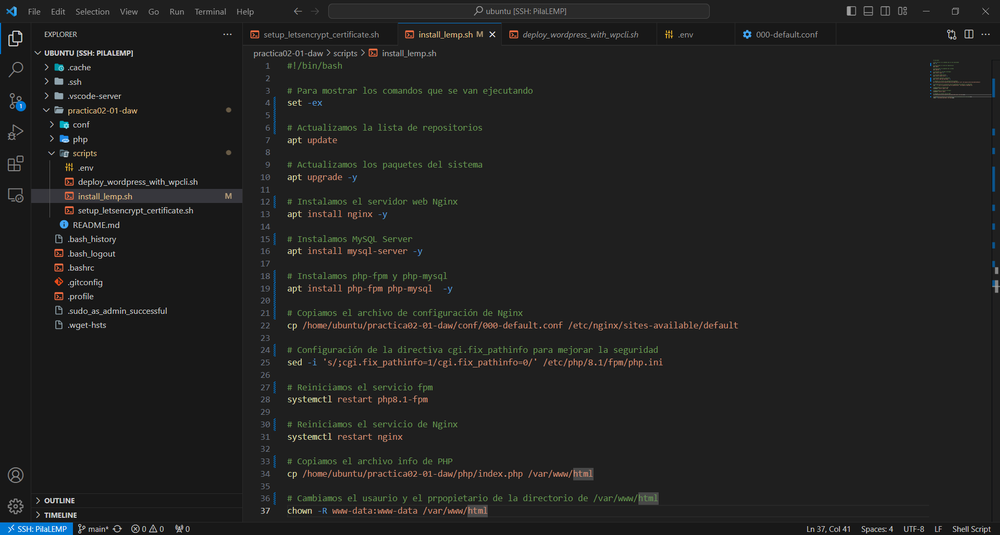
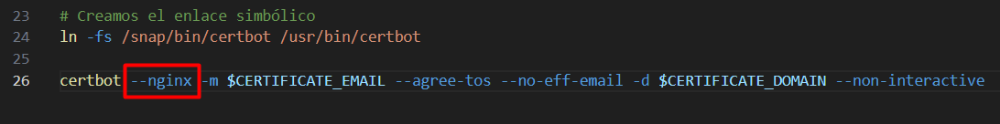
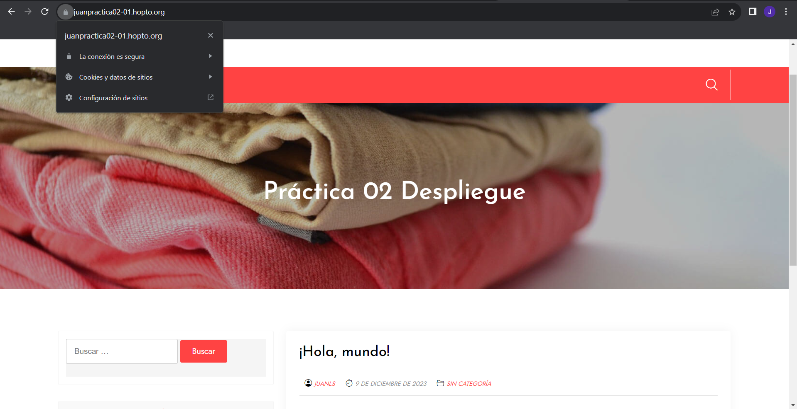

# Práctica 2.1 - Despliegue de WordPress utilizando una pila LEMP

## Parte 1 - Pasos previos a la instalación
Para crear una instancia en AWS, desplegar una aplicación en ella, asignarle un dns e instalarle un certificado ver la [práctica 1.6](https://github.com/jlopsan/practica01-06-daw.git)

## Parte 2 - Instalación y configuración de Wordpress sobre una pila LAMP

**Paso 1.** Para instalar WordPress, vamos a utilizar un script añadido en este repositorio con comentarios explicativos sobre lo que hace cada comando, este script realiza las mismas acciones que el de la [práctica 1.7](https://github.com/jlopsan/practica01-07-daw.git), pero utilizando un servidor *Nginx* en lugar de *Apache*, es decir, instala una pila LEMP en lugar de una pila LAMP:

**Paso 2.** La otra única modificación en los archivos de la [práctica 1.7](https://github.com/jlopsan/practica01-07-daw.git) es la de cambiar el parámetro `--apache` por `--nginx` en la instalación del certificado y ejecutamos ambos scripts, uno para instalar la pila LAMP y otro para el certificado de la página.

**Paso 3.** Finalmente, ejecutamos el script de WordPress con los comandos `chmod u+x deploy_wordpress_root_directory.sh` para darle permisos de ejecución al usuario y escribir el comando `sudo ./deploy_wordpress_root_directory.sh` para ejecutarlo:

**Paso 4.** Una vez ejecutado el script, podemos comprobar que WordPress se ha instalado correctamente sobre nuestro servidor Nginx:

